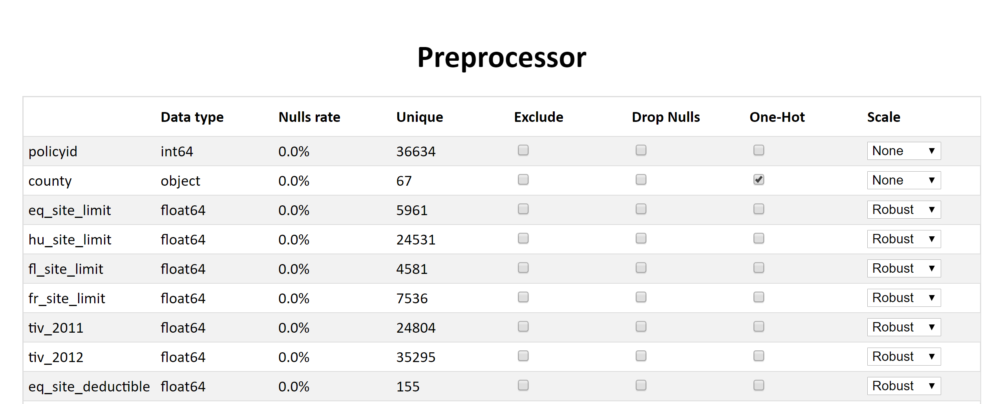

# Preprocessor
This is a simple and generic UI for quickly loading and preprocessing a CSV file.

## Step 1
Set up the project.
```
pip install -r requirements.txt
```

## Step 2
Open the Flask UI and visit `localhost:5000`.
```
python main.py data.csv
```


## Step 3
Select a configuration and click generate. By default, the following heuristics have been used:
- Exclude features with a null rate over 95%
- Exclude categorical variables with over 200 unique values
- One-hot encode all string variables
- Nulls are handled automatically, unless you want to enforce non-nullity for some parameters (e.g. targets) by ticking "Drop Nulls"
- All float64 fields are robust scaled by default, but you can choose min-max scaling

## Step 4
Click on `Generate` and copy the output JSON into `data/params.json`. Now you can copy this `data` folder into your project.

## Step 5
To use your preprocessor, use `Loader.load(<PATH TO CSV FILE>)` and `preproc = Preprocessor.build()` from within the directory. 
You can use the usual sklearn `fit`, `fit_transform` and `transform` on this `preproc` object now.
